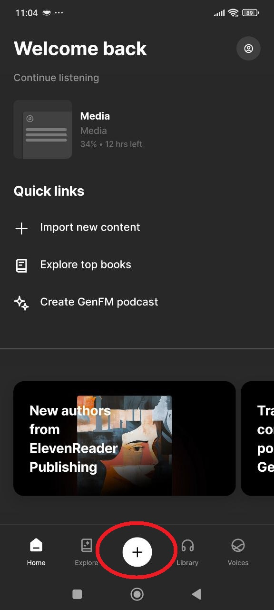
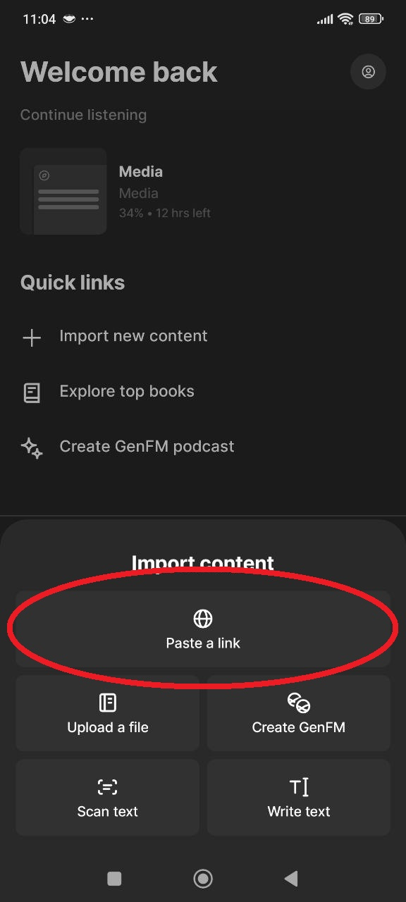
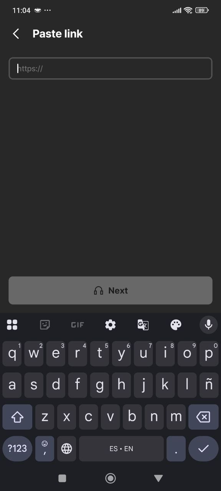
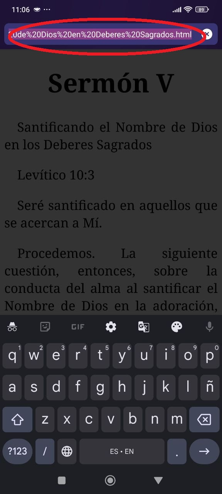
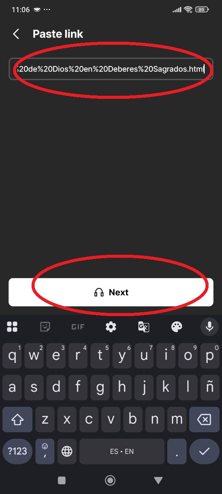
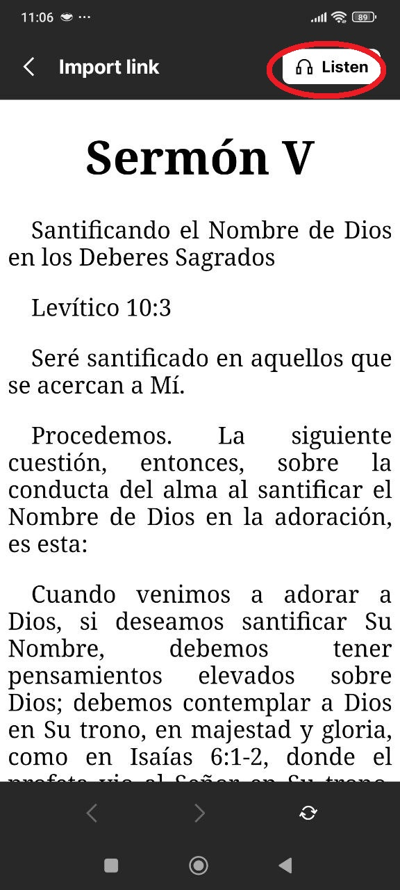

# Bienvenido a libros-teologia

¡Gracias por mostrar interés en nuestro proyecto! Este repositorio contiene una colección de textos teológicos traducidos al español, provenientes de siglos pasados. Nuestro objetivo es facilitar el acceso a estos libros y sermones que son de dominio público, permitiendo que más personas puedan beneficiarse de ellos en su propio idioma.

## Índice de Artículos

Puedes ver el índice completo de todos los artículos subidos hasta ahora [aquí](https://daniel08garcia.github.io/libros-teologia/).

## Leyendo el Artículo en Formato PDF

Para una experiencia de lectura más cómoda y portátil, te recomendamos imprimir el artículo en formato PDF. Para hacerlo, sigue estos pasos:

1. Abre el archivo HTML del artículo que deseas leer.
2. Utiliza la función de impresión del navegador web. Puedes acceder a esta función desde el menú del navegador o presionando `Ctrl + P` en Windows o `Cmd + P` en macOS.
3. Selecciona la impresora PDF como tu dispositivo de impresión.
4. Ajusta las configuraciones de impresión según tus preferencias, como el tamaño de la página, la orientación y los márgenes.
5. Haz clic en "Imprimir" para generar el archivo PDF.
6. Una vez que se complete la impresión, tendrás un archivo PDF listo para leer en tu dispositivo o para compartir con otros.

## Escuchando el Documento

Puedes aprovechar la función "leer en voz alta" del navegador Microsoft Edge o alguna aplicación como ElevenReader para escuchar los documentos en tu computadora o teléfono móvil. Para ello sigue estos pasos:

### Desde la app de ElevenReader

- **Toca el gran botón “+”** que aparece en el centro de la barra inferior. Ahí comienzan todas las importaciones de contenido.

- En el panel **Import content**, elige **“Paste a link”**. Esta opción sirve para transformar en audio cualquier página web o artículo en línea.

- Se abrirá el campo de texto para la URL.

- En tu navegador u otra app, **copia** el enlace del artículo (selecciónalo y pulsa ‘Copiar’). Este paso solo ilustra de dónde sale la dirección URL.

- Una vez pegado el enlace, el botón **“Next”** se iluminará. Tócalo para que ElevenReader analice la página y extraiga el texto.

- Cuando el artículo cargue, toca **“Listen”** (arriba a la derecha) para que la app genere y reproduzca el audio al instante. ¡Listo!

#### Consejos rápidos después de pulsar **Listen**

1. **==Cambiar voz, idioma o velocidad==:** toca el icono de ondas (abajo) mientras escuchas.
2. **Lectura destacada:** cada palabra se resalta a medida que se pronuncia, útil para seguir el texto.
3. **Sin gastar créditos:** la app usa un servidor aparte; no descuenta caracteres de tu plan ElevenLabs.
4. **Sólo streaming interno:** por ahora no se puede descargar el audio; vuelve a la app para re-escucharlo.

> **¿Problemas?**
>
> - Si el botón “Next” no se activa, asegúrate de que pegaste una URL completa que empiece por **https\://**.
> - Si aparece “Cannot process document”, intenta con otra página o espera unos minutos, puede ser saturación del servicio.

### Desde una Computadora de Escritorio:

1. Abre el documento HTML que deseas escuchar en Microsoft Edge.
2. Haz clic derecho en cualquier parte del documento para abrir el menú contextual.
3. Selecciona la opción "Leer en voz alta" o utiliza el atajo de teclado `F9`.
4. El navegador comenzará a leer el documento en voz alta. Puedes pausar, reanudar o detener la lectura según sea necesario.

### Desde un Dispositivo Móvil:

1. Abre el documento HTML que deseas escuchar en Microsoft Edge en tu dispositivo móvil.
2. Toca y mantén presionado cualquier parte del texto para seleccionarlo.
3. En el menú emergente, busca y selecciona la opción "Leer en voz alta".
4. El navegador comenzará a leer el texto en voz alta. Puedes ajustar la velocidad de lectura y detener la reproducción según sea necesario.

## Sobre el Proyecto

Este proyecto se enfoca en la traducción de textos teológicos de siglos pasados al español. Creemos que al hacer accesibles estos textos en español, estamos proporcionando una oportunidad para que más personas puedan estudiar y aprender de la rica tradición teológica de la historia de la Iglesia.

## Estructura del Proyecto

El proyecto está estructurado de la siguiente manera:

- siglo/
  - I/
    - [Nombre del Autor]/
      - [Nombre del Texto o Libro].html \* ...
  - II/
    - [Nombre del Autor]/
      - [Nombre del Texto o Libro].html \* ...
        - ...
    - ...

Los archivos se organizan por siglo y luego por el nombre del autor. Cada autor tiene una carpeta que contiene los textos correspondientes en formato HTML

Por ejemplo:

- `siglo/I/Ireneo de Lyon/Contra las herejías.html`
- `siglo/II/Orígenes/De principiis.html`

## Contribuciones

¡Estamos abiertos a contribuciones! Si deseas agregar más textos, corregir errores o mejorar la estructura del proyecto, no dudes en enviar un pull request . Consulta el archivo `CONTRIBUTING.md` para obtener más información sobre cómo contribuir.

## Contacto

Si tienes alguna pregunta o sugerencia, no dudes en abrir un issue o ponerte en contacto con el equipo de colaboradores.

¡Esperamos que disfrutes explorando estos valiosos textos teológicos en español!
